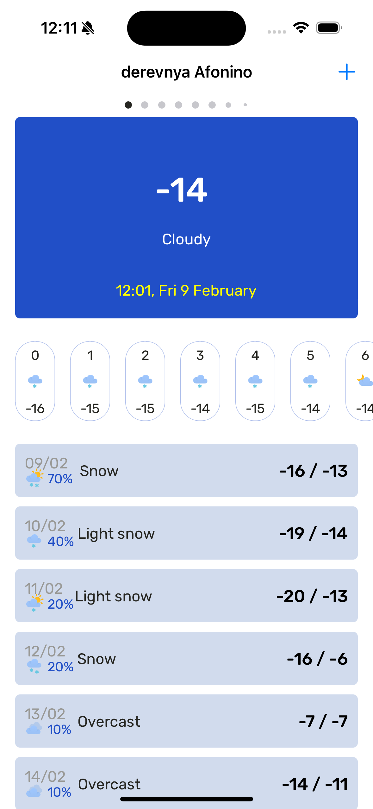
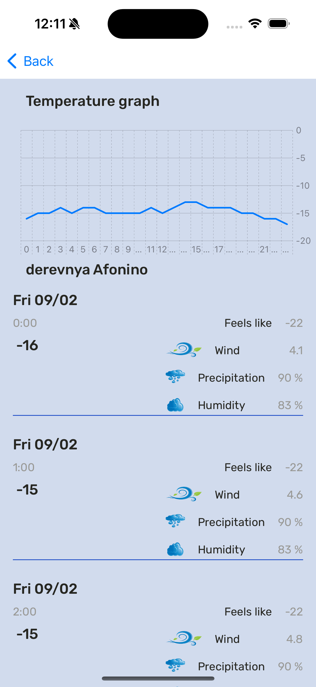
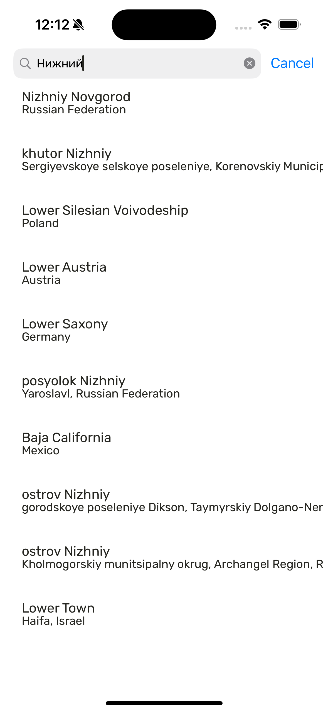
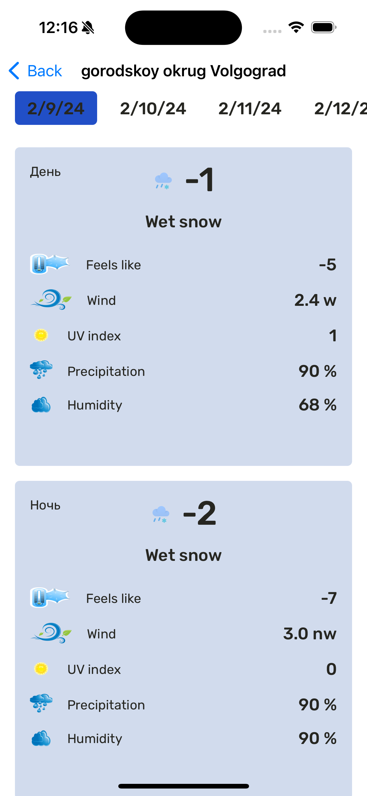
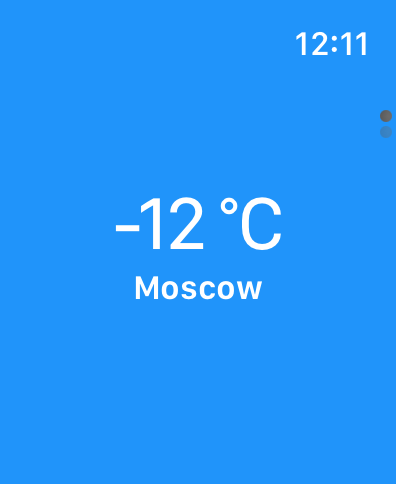
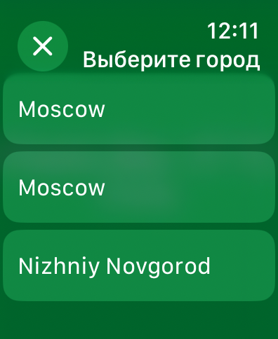

# Приложение погоды
Используется бесплатная API - Яндекса, спустя 30 дней/ поменять ключ в файлах EnterPoint
Локализация и темизация присутсвует
Есть приложение для AppleWatch, настроена синхронизация между телефоном и часами
Используется UICollectionView - с применением DiffableDataSource и CompositionalFlowLayout
UIKit + SWiftUI, MVVM, Combine, Async/Await, Coordinators
Сетевой слой выделен в отдельную сущность

<video width="320" height="240" controls>
  <source src="images/screencast.mov" type="video/mp4">
</video>